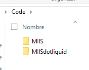

# MIIS: A Markdown File-based CMS for IIS and Azure

A Markdown and HTML file-based CMS system for IIS by [@jm_alarcon](https://twitter.com/jm_alarcon).

> **IMPORTANT**: In order to be able to compile the source code of this project you first need to download the code of the complementary project [MIISDotLiquid](https://github.com/jmalarcon/MIISdotliquid). You must clone it in a `MIISDotLiquid` folder inside the same folder of the MIIS project:
>
> 
>
> This is a related project for the Liquid tags processor and is referred by folder name in the project's file. I'm using a fork of the DotLiquid project that seems abandoned. Please, set the `Tests` project of the solution as the Starter Project in Visual Studio to run the tests and see how it works in detail.

MIIS is a perfect blend between a traditional CMS (such as Wordpress) and a Static Site Generator (such as Jekyll). Get the best of both worlds:

- No backend database or special setup needed
- No need to recompile and deploy after any change
- Lightning-fast, without unneeded bloat
- Support for Liquid tags, templates with inheritance and many more features similar to Jekyll

**Set up your Markdown-based documentation system or web site in less than 30 seconds!**

## System Requirements

- **Internet Information Server** on Windows Server, or an **Azure Web App**
- **.NET Framework 4.5** or later (usually already installed on the server)

## Features

- Create **full-fledged web sites** and documentation sites based on Markdown and HTML files
- Easy support for **custom templating and navigation** for the served files. You can **create a CMS** (Content Management System) directly from Markdown files in no time!
- Generate site pages on the fly from Markdown files or HTML (`.mdh` files), with navigation and all the common elements in the site
- **Super-flexible and easy template creation**, with "includes" support, Liquid tags, parameters, file enumeration, inheritance...
- Custom properties that can be used in any file
- **Powerful "Fragments" and "Component" features** that allows to assemble contents dynamically from several files.
- Use query string or form parameters, cookies and server variables as part of your content (and to make decisions with DotLiquid).
- Process files in folders from Markdown or HTML: to create a blog, create multilingual sites, manage authors...
- Markdown file caching and template caching for **maximum performance**
- **Customize per folder**: define different look&feel, layout, navigation, fields/properties for specific files or folders [using different `web.config` files](https://blog.elmah.io/web-config-location-element-demystified/).
- Several documentation site templates included out of the box
- **Great support for Markdown** and [Markdown extras](Markdown-Features) for the content

Check the **[full documentation](http://miis.azurewebsites.net/)**.

## Showcase

These are some sites that run with MIIS:

- [MIIS Documentation Site](https://miis.azurewebsites.net/). Azure App.
- [campusMVP](https://www.campusmvp.es/): On-line training company. More than 300K unique users monthly. Windows Server.
- [jmalarcon.es](https://jmalarcon.es/): My personal (non-technical) blog. Azure App.
- [SELF LMS](https://www.plataformaself.com/): Site and blog for a Learning Management System software. Windows Server.
- [IISMailer](https://iismailer.com/): Form processing software for ISS website and docs. Azure App.
- [Krasis.com](https://www.krasis.com/): Basic corporate website. Windows Server.
- [Alquiler Sanxenxo](https://www.alquilersanxenxo.com/): Seaside flat rental site. Azure App.
- [Krasis Intranet](https://krasisintranet.azurewebsites.net/): private, OAuth 2.0 protected Intranet site. Azure App.

Using MIIS for your website, documentation or any other thing? Just [tell me](https://jmalarcon.es/contacto/) to get a link here 😊