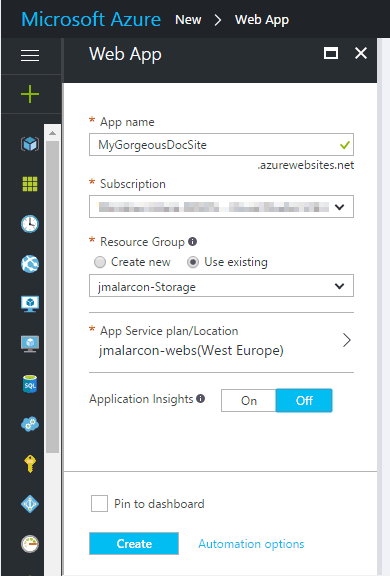
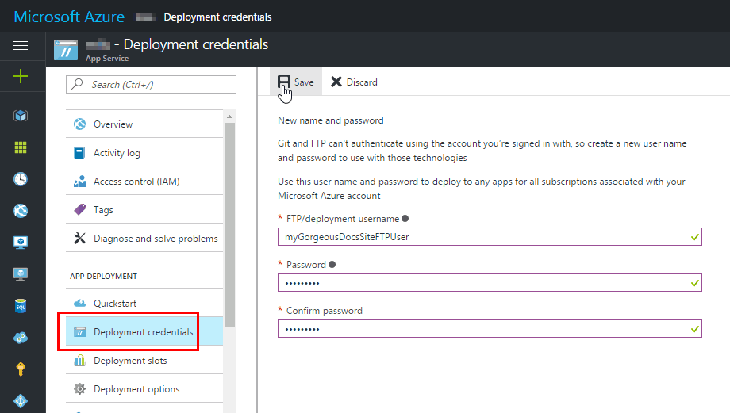
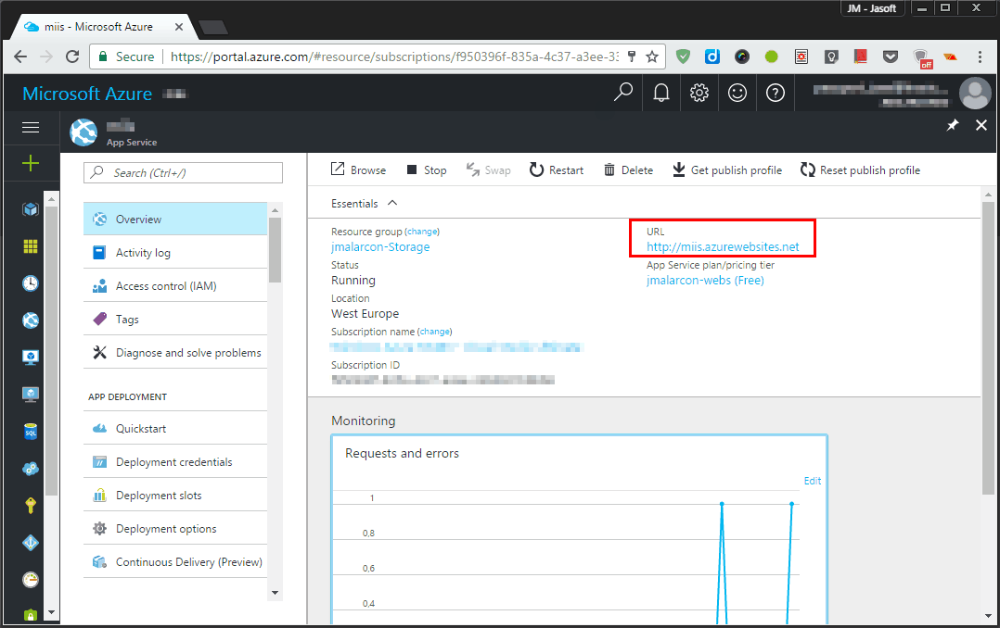

# How to run MIIS in Azure Web Sites

Running a documentation site publicly, **on the Web, for free** is really easy with [Azure Web Sites](https://azure.microsoft.com/en-us/services/app-service/web/).

## Step by Step Instructions:
1. **Create your [free Azure account](https://azure.microsoft.com/en-us/free/)** if you don't have one.
2. Go to the [Azure Portal](https://portal.azure.com) and **create a new _Web App_**.

Choose a name for your site that is descriptive and available, create a new resource group (choose the free tier) or select a existing one, and choose a location for the site:

Click the "Create" button. After a few seconds your site will be available.

3.- **Deploy your contents** to Azure.

You can deploy to Azure using a lot of different methods. I, for example, like to deploy my sites directly from their Git repository or from DropBox. But the easiest and more straight-forward way is through FTP.

Go to your Web App properties and search for "Deployment Credentials". Enter a user name and (complex) password to access your site through FTP:

4.- **Transfer files** to your Web App.

Go to the "Overview" section of your Web App to get its URL:

Now you can access the FTP site in the same URL with the `ftp://` protocol, for example: `ftp://mySuperSite.azurewebsites.net`

>You can use a decent graphic FTP client such as [Filezilla](https://filezilla-project.org/) to be more comfortable.

Make sure you upload not only your Markdown documents, but the MIIS sub-folders ("bin", "CSS", "templates") and `web.config` file.

Now, browse your site going to its public URL. Here you go!

>It is possible to do a lot of advanced things in your site, such as make it private and only accessible with specific accounts (Active Directory, Office 365, Google..), deploy automatically from a Git repository, deploy manually from a cloud drive... Make sure to check Azure's documentation on that.