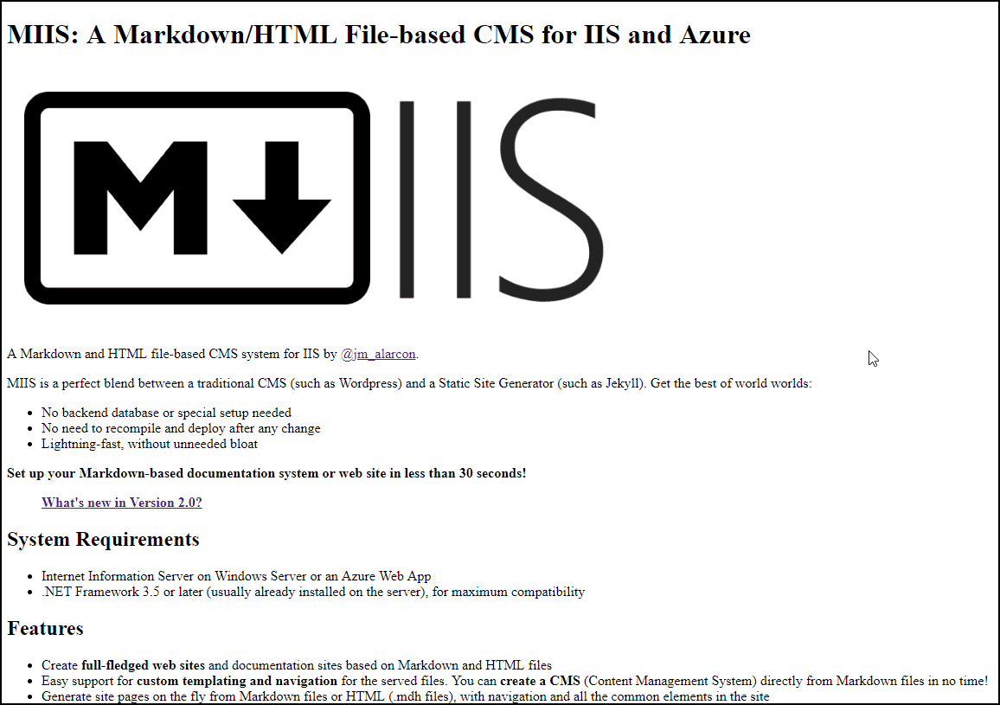

# Serving plain HTML - The cssfile parameter

You can run MIIS **without any parameters** in your `web.config`. That will work, but the Markdown will be served as plain HTML. Files will look a little bit ugly since no CSS is applied to beautify the output:



The **default template**, if no other one is specifically set, simply returns the HTML5 version of the Markdown file, without any CSS applied to it. But this default HTML content includes **a parameter called `cssfile`** that you can set to include a specific CSS file with every response. For example, you can define this in your `web.config`:

```
<add key="MIIS:cssfile" value="{{tilde}}/CSS/github.css" />
```

This will use the Github styles in the returned HTML.

I've included **[several CSS files with MIIS](cssStyles)** for you to use immediately, and you can add your own anytime.

You can also specify this parameter directly in the file's Front Matter, for example:

```

---
cssfile: {{tilde}}/CSS/github.css
---
```

> **IMPORTANT**: notice how you can use the **relative path syntax** of ASP.NET, with a `{{tilde}}` at the beginning of the path, so that the resulting CSS is always pointing to the root of the application. If the Markdown is served from the root folder of the virtual server using `{{tilde}}/` or `/` will be the same thing. But if your Markdown app is hosted as a virtual app or virtual folder in IIS or Azure Web Apps, this is a very important feature to use.

You can serve the Markdown files using a full-fledged template with content parameters, navigation, etc... Check the [Configuration](Settings) section for this.