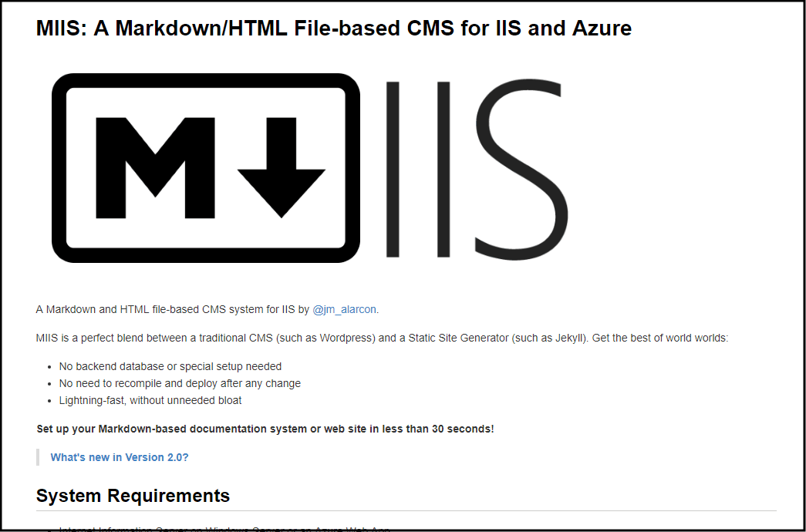
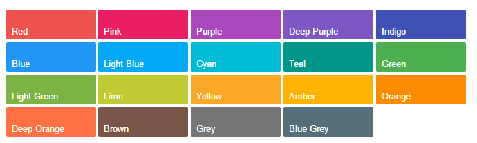
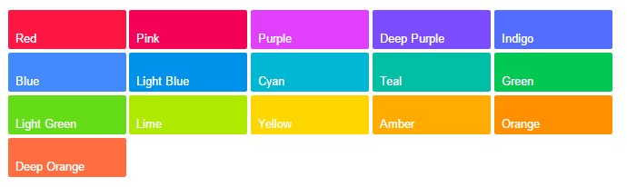

# List of templates available out of the box

## :page_facing_up: Default 
The default template is applied automatically when you don't specify the `Markdown-Template` parameter in the `web.config` file of your site. It simply returns a plain HTML5 file with the transformed contents of each Markdown file. It has a parameter called `cssfile` that allows you to style the resulting HTML. See [included CSS styles](cssStyles.md) for more information.

#### Available parameters:
- `cssfile`: to define the CSS file controling the resulting HTML look and feel.

## :page_facing_up: Barebones
A simple template that uses the same `cssfile` parameter (as the default one) and adds information about the Markdown file in the footer of every page and a link to download the original markdown file (you must [enable this feature](settings.md) or get rid of this link in the template).

#### Available parameters:
This template has the following parameters that you can set:

- `sitetitle`: the site's title.
- `cssfile`: to define the CSS file controlling the resulting HTML look and feel.

## :page_facing_up: ReadTheDocs
A template that mimics the look and feel of the old [Read The Docs](https://readthedocs.org/) site. Reused from the [MKDocs project](http://www.mkdocs.org/) and extended with extra functionality.

#### Extra features:
- It highlights the link on the right side pointing to the current shown document, and collapses the second level lists of links that are not in the same group of that one (only if the first-level item is a link itself). That allows to use long tables of contents with sub-sections.
- It automatically numbers the sections and subsections so you don't need to do it in the table of contents files, adapting automatically to changes in the ToC order. You can disable this feature just by commenting the last 4 CSS rules in the `theme_extra.css` file of the template.
- Shows Previous and Next buttons in the footer for easy navigation.
- It shows a small icon after links that point to external domains.

With this template you can set up a full-fledged documentation system in just under a minute.

#### Available parameters:
This template has the following parameters that you can set:

- **`sitetitle`**: a title for the site. Used in the upper part of the lateral navigation menu and in all the pages title before the title of the document.
- **`toc`**: points to a .md file to create the side navigation menu.
- **`description`**: the description for the `<meta>` tag of the page.
- **`author`**: the name of the author of the site to use in the corresponding `<meta>` tag.
- **`copyright`**: a copyright message to show in the footer of every page.
- **`authorgithub`**: the part after `https://github.com/` to use in the github link of the template. If you don't want the github icon to appear you must delete that from the `main.html` file of the template.
- **`prevtext`**: the text to use in the "go to previous" button in the footer
- **`nexttext`**: the text to use in the "go to the next" button in the footer
- **`gaaccount`**: the user account ID for Google Analytics. Usually has the name "UA-XXXXX-YY". This will allow you to receive usage statistics for your documentation site.

## :page_facing_up: Material
This is a material-inspired template. It gives a clean and modern UI and allows to choose among several colors with a parameter.

#### Extra features:
- It highlights the link on the right side pointing to the current shown document, and collapses the second level lists of links that are not in the same group of that one (only if the first-level item is a link itself). That allows to use long tables of contents with sub-sections.
- It automatically numbers the sections and subsections so you don't need to do it in the table of contents files, adapting automatically to changes in the ToC order. You can disable this feature just by commenting the last 4 CSS rules in the `theme_extra.css` file of the template.
- Shows Previous and Next buttons in the footer, including the title of those documents, for easy navigation.
- It shows a small icon after links that point to external domains.
- Automatically adds zoom to images that don't fit in the available width (with [Zoomify.js](https://github.com/indrimuska/zoomify))

With this template you can set up a full-fledged documentation system in just under a minute.

#### Available parameters:
This template has the following parameters that you can set:

- **`sitetitle`**: a title for the site. Used in the upper part of the lateral navigation menu and in all the pages title before the title of the document.
- **`logo`**: the path, from the base folder, of the logo we want to use in the side bar. It should be squared, and the template will fit it to the available space. If it's located in the root folder, for example, the value would be simply the name of the image file.
- **`toc`**: points to a .md file to create the side navigation menu.
- **`primarycolor`**: the main color for the theme, It can use any of the main Material colors (see next picture) Color names for this parameter are written in lowercase, and if they have two words the space is substituted by a "-". For example, "Blue Grey" would be "blue-grey".

- **`accent`**: the accent for the selected color. Its used sparsely in the template. The available colors are:

- **`description`**: the description for the `<meta>` tag of the page.
- **`author`**: the name of the author of the site to use in the corresponding `<meta>` tag.
- **`copyright`**: a copyright message to show in the footer of every page.
- **`authortwitter`**: the twitter handler of the site to use in the Twitter button link.
- **`authorgithub`**: the part after `https://github.com/` to use in the github link of the template. If you don't want the github icon to appear you must delete that from the `main.html` file of the template.
- **`prevtext`**: the text to use in the "go to previous" button in the footer
- **`nexttext`**: the text to use in the "go to the next" button in the footer
- **`gaaccount`**: the user account ID for Google Analytics. Usually has the name "UA-XXXXX-YY". This will allow you to receive usage statistics for your documentation site.

With this template you can set up a full-fledged documentation system in just under a minute.

More templates to come!