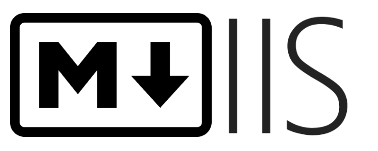

# MIIS: A Markdown File-based CMS for IIS and Azure

A Markdown and HTML file-based CMS system for IIS by [@jm_alarcon](https://twitter.com/jm_alarcon).

MIIS is a perfect blend between a traditional CMS (such as Wordpress) and a Static Site Generator (such as Jekyll). Get the best of world worlds:

- No backend database or special setup needed
- No need to recompile and deploy after any change
- Lightning-fast, without unneeded bloat

**Set up your Markdown-based documentation system or web site in less than 30 seconds!**

> **[What's new in Version 2.1?](releases)**

## System Requirements

- Internet Information Server on Windows Server or an Azure Web App
- .NET Framework 3.5 or later (usually already installed on the server), for maximum compatibility

## Features
- Create **full-fledged web sites** and documentation sites based on Markdown and HTML files
- Easy support for **custom templating and navigation** for the served files. You can **create a CMS** (Content Management System) directly from Markdown files in no time!
- Generate site pages on the fly from Markdown files or HTML (.mdh files), with navigation and all the common elements in the site
- Super-flexible and easy template creation, with "includes" support
- Custom properties that can be used in any file
- Powerful "Fragments" feature that allows to assemble contents dynamically from several files
- Define different look&feel, layout or navigation for specific files or folders
- Several documentation site templates included out of the box
- Markdown file caching and template caching for **maximum performance**
- **Great support for Markdown** and [Markdown extras](Markdown-Features)
- Serve **plain HTML from Markdown** (use as a simple Markdown handler) with custom CSS
- Out of the box support for all **the most common markdown file extensions**: `.md, .markdown, .mdown, .mkdn, .mkd`. You can [add your own extensions](Managing-File-Extensions)

## Quick Start

Your Markdown-based site running in less than 30 seconds:

1. Create an IIS virtual server or an Azure Web App pointing to an empty folder
2. Download the latest version of **MIIS** from the ["Releases" section](https://github.com/jmalarcon/MIIS/releases) of the MIIS GitHub repository
3. Uncompress the contents of the ZIP file inside the folder from step 1
4. Navigate to your website with the browser

You're all set up! Now you have a sample site with minimum contents. Just create new .md (Markdown) or .mdh (HTML) files and browse to them to get them rendered with the current template. Optionally add them to the default template's navigation bar creating a link in the `toc.md` file located at the root folder.

There are two types of plain-text files that you can use to be rendered by MIIS:

- **Markdown files**: Normally you'll use the `.md` file extension for these files (although you can [configure other extensions](Managing-File-Extensions)). They contain Markdown that is transformed into HTML before rendering.
- **HTML Content Files**: with the mandatory `.mdh` file extension. Any content inside these files is injected as-is in the chosen template for the site. This allows to create complex HTML contents when Markdown is not enough.

You can mix MIIS with your own ASP.NET, PHP, Node.js or any other server-side resource.

## Advanced set-up

- [Configuration/Settings](Settings)
- [Out-of-the-box templates](Template-List)
- [Define custom templates](Templating)
- [Manage Markdown file extensions](Managing-File-Extensions)
- [How to run locally with IISExpress](IISExpress)
- [How to run in Azure](Azure)

## Source code
This is free and Open Source software (FLOSS). You can check the full code and documentation on [GitHub](https://github.com/jmalarcon/MIIS).

## Contribute
You can contribute to the project with bug fixes, **new templates**, new features and **translations** of this documentation to other languages. Follow the normal flow of OSS contributions in GitHub (fork, make changes, pull request).

I plan to add a "Showcase" section in the future. **If you use MIIS** to create a website, the documentation for your project, a document-based site, etc... please **tweet it to me** with the URL. Thanks!

And spread the word. Thanks! :smile:

You can open any issues you may face, using the ["Issues" section](https://github.com/jmalarcon/MIIS/issues) for the project on GitHub.